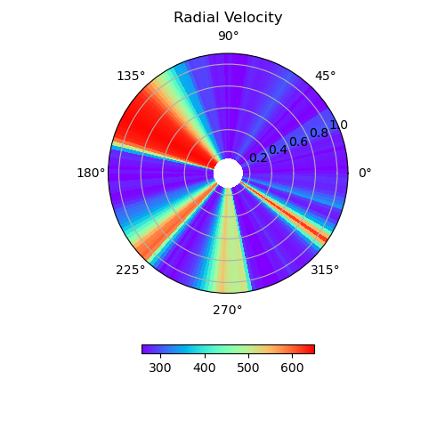

Examples
========

Example #1: Equatorial Slice
----------------------------

.. code-block:: python

    import os
    import sys
    import pysunrunner
    import pysunrunner.pload as pp
    import pysunrunner.io as io
    import pysunrunner.pviz as pviz
    import numpy as np
    import matplotlib.pyplot as plt
    from pathlib import Path
    import requests

    def download_files(base_url, local_dir):
        if not os.path.exists(local_dir):
            os.makedirs(local_dir)

        # Assuming you have a list of filenames
        filenames = ['dbl.out','Bx1.0000.dbl','prs.0000.dbl','rho.0000.dbl','vx1.0000.dbl','grid.out']
        for filename in filenames:
            url = os.path.join(base_url, filename)
            local_path = os.path.join(local_dir, filename)
            response = requests.get(url)
            with open(local_path, 'wb') as f:
                f.write(response.content)
            print(f"Downloaded {filename}")

    base_url = 'http://www.predsci.com/~pete/research/sunrunner/test/output/'
    local_dir = './local_files/'

    download_files(base_url, local_dir)

    time_idx = 0

    # Load PLUTO results for this time point
    D = pp.pload(time_idx, w_dir=local_dir, datatype='dbl')

    # the coordinates are D.x1 D.x2 and D.x3 (r, theta, phi)
    r_coords = np.array(D.x1)
    t_coords = np.array(D.x2)
    p_coords = np.array(D.x3)
    fig, ax = plt.subplots(subplot_kw={'projection': 'polar'}, figsize=(6, 6))
    data = getattr(D, 'vx1')
    ax = pviz.plot_equatorial_cut(data=data, r_coords=r_coords, t_coords=t_coords, p_coords=p_coords,
                                  ax=ax, cmap='rainbow', title='Radial Velocity', zmin=200, zmax=2200)
    plt.show()
